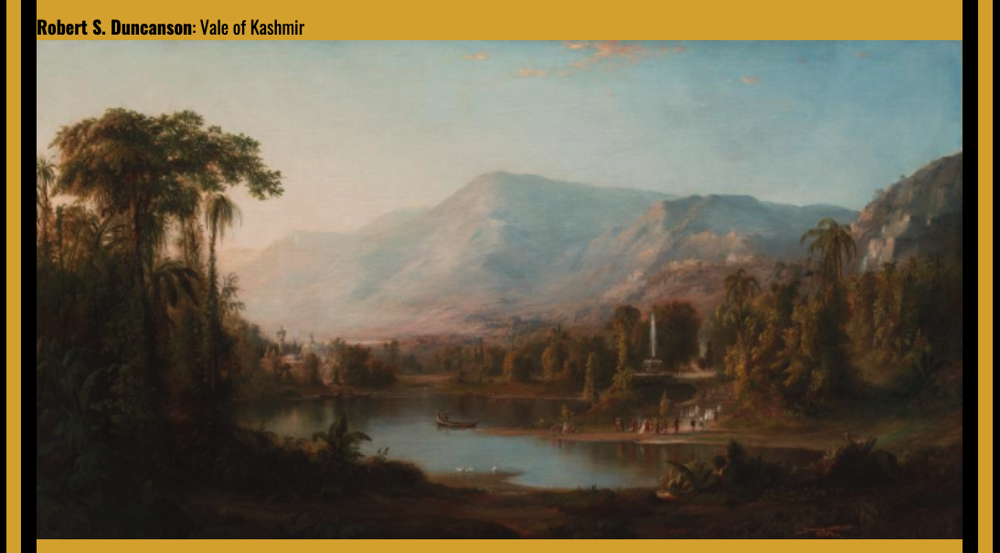

# Virtual Melanin Museum

A web application with easy functionality that specifically displays Black Artist from all eras and their art.

## Technologies
- HTML5
- CSS3
- JavaScript
- jQuery
- [The Cleveland Museum of Art](https://openaccess-api.clevelandart.org/api/artworks/?&african_american_artists)

 
 

## User Stories
- As a user I would like to understand what I am seeing when I first click on the page.
- As a user I want to see information about each artist and the art that is showing.
- As a user I would like to see a simple but attractive layout.

 
 

## Screenshots

 

### Wireframe

## Getting Started

[Click here](https://virtual-melanin-museum.netlify.app/) to see working app.

## Future Enhancements

- The ability to click on the image that pop up to take user to more information about the artist.